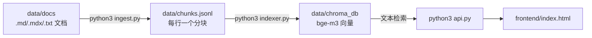

# LangChain 本地文档 RAG

基于 LangChain 的本地文档检索增强生成（RAG）Demo：把 LangChain 官方文档（MDX）切分、向量化后存入本地 Chroma，配合 LLM 回答技术问题。

- **分块**：`ingest.py` 针对 MDX 优化——清理 frontmatter/import/JSX 噪音，按标题层级维护路径，代码块原子化不截断
- **嵌入**：本地 HuggingFace `BAAI/bge-m3`（多语言，1024 维），零 API 成本
- **生成**：OpenAI 兼容接口（示例配置为 DeepSeek），仅对话时调用 API
- **存储**：Chroma 本地持久化，嵌入由向量库内部完成

## 工作原理



## 快速开始

建议 Python 3.14

```bash
# 1. 下载 LangChain 文档并节选需要的部分（已有文档可跳过此步）
git clone --depth 1 https://github.com/langchain-ai/docs.git /tmp/langchain-docs
mkdir -p data/docs
# 节选示例：只拷 RAG 与 Agents 相关文档
cp /tmp/langchain-docs/src/oss/langchain/retrieval.mdx \
   /tmp/langchain-docs/src/oss/langchain/knowledge-base.mdx \
   /tmp/langchain-docs/src/oss/langchain/agents.mdx \
   /tmp/langchain-docs/src/oss/langchain/sql-agent.mdx \
   data/docs/
cp -r /tmp/langchain-docs/src/oss/langchain/multi-agent data/docs/

# 2. 安装依赖（首次会拉取 torch / sentence-transformers，较大，耐心等待）
python3 -m venv .venv
source .venv/bin/activate
pip install -r requirements.txt

# 3. 填写配置
cp .env.example .env

# 4. 建库
python3 ingest.py                 # 切分：MDX 清理 → 标题路径 → 代码块原子化
python3 indexer.py --rebuild      # 嵌入并写入 Chroma（首次运行下载 bge-m3 模型）

# 5. 启动服务
python3 api.py

# 6. 打开前端（CORS 已放开，直接双击或用浏览器打开文件即可）
open frontend/index.html                      # macOS
# Linux: xdg-open frontend/index.html         # Windows: 直接双击文件
```

## 项目结构

```
rag-demo/
├── ingest.py            # 文档清洗和切分
├── indexer.py           # 向量化和入库
├── api.py               # FastAPI 服务：/query（检索 + 生成）、/（状态）
├── config.py             # 全局配置
├── llm_providers/       # 聊天 LLM（ChatOpenAI）与本地 Embedding（HF）工厂
├── vector_stores/       # 向量存储实现
├── frontend/index.html  # 查询页面
├── data/docs/           # LangChain 文档
```

## 常见问题

- **首次运行很慢/下载大文件**：`bge-m3` 模型约 2.2GB，下载到 `~/.cache/huggingface`，只发生一次。
- **`Collection expecting embedding with dimension ...`**：索引与当前嵌入模型维度不一致（换过模型），`python3 indexer.py --rebuild` 重建。
- **`LLM 生成失败`**：检查 `CHAT_API_KEY` 与网络，或 `CHAT_BASE_URL` 是否指向正确的兼容接口。
- **重复运行 `indexer.py` 会重复插入**：加 `--rebuild` 先清空再建。
