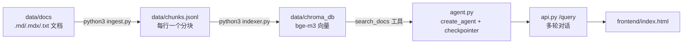

# LangChain 本地文档 RAG

基于 LangChain 的本地文档检索增强生成（RAG）Demo：把 LangChain 官方文档（MDX）切分、向量化后存入本地 Chroma，配合 LLM 回答技术问题。

- **分块**：`ingest.py` 针对 MDX 优化——清理 frontmatter/import/JSX 噪音，按标题层级维护路径，代码块原子化不截断
- **嵌入**：本地 HuggingFace `BAAI/bge-m3`（多语言，1024 维），零 API 成本
- **生成**：OpenAI 兼容接口（示例配置为 DeepSeek），仅对话时调用 API
- **存储**：Chroma 本地持久化，嵌入由向量库内部完成

## 工作原理



Agent 模式：技术问题由 LLM 自主决定调用 `search_docs`（可自行构造英文查询、多次调用），闲聊直接回答；`thread_id` 保持多轮记忆（`InMemorySaver`，重启丢失）。请求示例：`{"question": "...", "thread_id": "可选"}`，响应含 `tool_calls`（Agent 的检索记录）。

多 Agent 模式：两个 subagent 以 tool-per-agent 方式挂给主 Agent 编排（上下文隔离，可独立再检索）——**查询规划员**把复杂问题拆成多个英文子查询逐一检索以扩大召回，**审校员**对回答草稿逐条事实核查、发现问题则修正后输出。响应含 `review` 字段（审校结论），前端显示审校徽标。由前端"审校员核查"复选框按请求开关，默认关闭。

## 快速开始

建议 Python 3.14

```bash
# 1. 下载 LangChain 文档并节选需要的部分（已有文档可跳过此步）
git clone --depth 1 https://github.com/langchain-ai/docs.git /tmp/langchain-docs
mkdir -p data/docs
# 节选示例：只拷 RAG 与 Agents 相关文档
cp /tmp/langchain-docs/src/oss/langchain/retrieval.mdx \
   /tmp/langchain-docs/src/oss/langchain/knowledge-base.mdx \
   /tmp/langchain-docs/src/oss/langchain/agents.mdx \
   /tmp/langchain-docs/src/oss/langchain/sql-agent.mdx \
   data/docs/
cp -r /tmp/langchain-docs/src/oss/langchain/multi-agent data/docs/

# 2. 安装依赖（首次会拉取 torch / sentence-transformers，较大，耐心等待）
python3 -m venv .venv
source .venv/bin/activate
pip install -r requirements.txt

# 3. 填写配置
cp .env.example .env

# 4. 建库
python3 ingest.py                 # 切分：MDX 清理 → 标题路径 → 代码块原子化
python3 indexer.py --rebuild      # 嵌入并写入 Chroma（首次运行下载 bge-m3 模型）

# 5. 启动服务
python3 api.py

# 6. 打开前端（CORS 已放开，直接双击或用浏览器打开文件即可）
open frontend/index.html                      # macOS
# Linux: xdg-open frontend/index.html         # Windows: 直接双击文件
```

## 项目结构

```
rag-demo/
├── ingest.py            # 文档清洗和切分
├── indexer.py           # 向量化和入库
├── agent.py             # Agent：create_agent + search_docs 工具 + checkpointer 记忆
├── api.py               # FastAPI 服务：/query（Agent 多轮对话）、/（状态）
├── eval.py              # 检索质量评测：Recall@k / MRR@k
├── compare_baseline.py  # 裸 LLM 直答 vs RAG 对照（产出 Markdown 报告）
├── config.py             # 全局配置
├── llm_providers/       # 聊天 LLM（ChatOpenAI）与本地 Embedding（HF）工厂
├── vector_stores/       # 向量存储实现
├── frontend/index.html  # 查询页面
├── data/docs/           # LangChain 文档
├── data/eval_questions.jsonl  # 评测问题集（question + expected_sources）
```

## 检索评测

```bash
python3 eval.py --verbose --output data/eval_report.json   # 原始检索能力（不过滤）
python3 eval.py --threshold 0.3                            # 模拟线上阈值过滤后的表现
```

每行一个 JSON：`{"question": "...", "expected_sources": ["xxx.mdx"]}`。命中定义为 top-k 结果中出现任一期望来源。共 36 题（覆盖 30/30 文档），其中 3 题是语料外诚实度题（`expect_not_found: true`，期望回答"未找到"），检索层评测自动跳过、仅 Agent 级评测使用。

对比向量存储后端（默认 chroma；hybrid 为向量+BM25 的 RRF 融合）：

```bash
VECTOR_STORE_BACKEND=hybrid python3 eval.py --output data/eval_report_hybrid.json
```

> 实测结论：中文查询 + 英文文档场景下 hybrid 反而更差（Recall@5 93.94% → 87.88%），BM25 跨语言几乎匹配不到关键词，还会把含高频词的无关块顶上来。默认保持 chroma。

### Agent 级评测

检索层评测（`eval.py`）绕过 Agent 直测 `similarity_search`；`eval_agent.py` 走完整 `/query` 链路，对比单 Agent 与多 Agent（规划员+审校员）：

```bash
python3 eval_agent.py   # 36 题 × 两组 → data/eval_agent_report.json
```

> 实测结论（[data/eval_agent_report.json](data/eval_agent_report.json)，36 题 = 33 检索题 + 3 语料外诚实度题）：
> - **Agent 化本身即是检索增强**：单 Agent 正确率 97.22%，高于纯检索的 93.94%——LLM 自主多查询检索补上了检索层的 miss
> - **多 Agent 的代价与收益**：正确率同为 97.22%（检索侧已到 embedding 语义天花板），延迟 10.0s→47.8s、token ×3.2；收益在质量兜底——2/36 题被审校员判"存疑"，其中 1 题触发打回重查（`review_answer → 再次 search_docs → review_answer`）
> - **审校员误报可量化调优**：初版 prompt 误把措辞不精确判为"存疑"（4/36）；在 prompt 中明确"只有实质性错误（API 错误、与文档相悖的建议、无据断言）才判存疑"后降至 2/36，且剩余 2 题复核确认文档有据——边界 case 的波动而非真错误
> - **诚实度**：两组在 3 道语料外题目上全部正确回答"未找到"；最极端的一题（LangGraph Platform 部署）多 Agent 组换关键词检索 23 次后仍坚持拒答，审校员对拒答结论放行
> - **规划员按需启用**：36 题中 17 题走了 `plan_queries` 拆题，复杂题才付出规划成本

pgvector 后端（适合部署：向量与记忆共用一个 Postgres，状态全外置）：

```bash
# 一次性准备：PostgreSQL 装 pgvector 扩展，建库
psql -d postgres -c "CREATE DATABASE rag_demo;"
psql -d rag_demo -c "CREATE EXTENSION vector;"
# 向量表（langchain_pg_*）与记忆表（checkpoints 等）首次运行自动创建

VECTOR_STORE_BACKEND=pgvector python3 indexer.py            # 建库
VECTOR_STORE_BACKEND=pgvector python3 eval.py --output data/eval_report_pgvector.json
VECTOR_STORE_BACKEND=pgvector MEMORY_BACKEND=postgres python3 api.py   # 记忆跨重启保留
```

> 实测：pgvector 与 chroma 召回一致（Recall@5 93.94%），但分数为余弦相似度，尺度不同（0.56~0.75），阈值建议 `RETRIEVAL_SCORE_THRESHOLD=0.5`。

对比查询改写（检索前用 LLM 把问题改写成英文技术查询，需 `CHAT_API_KEY`）：

```bash
python3 eval.py --rewrite --output data/eval_report_rewrite.json
```

线上开启：`QUERY_REWRITE=1`（默认 0 关闭）。

## 裸 LLM vs RAG 对照

```bash
QUERY_REWRITE=1 python3 compare_baseline.py   # 8 道题 × 直答/RAG 各一次 → data/baseline_comparison.md
```

实测（[data/baseline_comparison.md](data/baseline_comparison.md)）：裸模型倾向给旧版 API（`AgentExecutor`、`RunnableWithMessageHistory`、`create_react_agent`），RAG 严格按 LangChain 1.x 文档回答（`create_agent` + `checkpointer`、`HumanInTheLoopMiddleware` 等），文档未涵盖时明确回答"未找到"而非凭记忆补全。

## 部署（小内存服务器 / serverless 友好）

本地开发默认形态（Chroma 文件 + 本地 HF 模型 + 进程内存记忆）有三个部署障碍：torch 占 ~3GB 内存、Chroma 依赖本地文件、记忆随进程消失。对应的可切换后端：

| 组件 | 本地默认 | 部署形态 |
|---|---|---|
| Embedding | `EMBEDDING_BACKEND=hf`（本地 bge-m3） | `api`（OpenAI 兼容接口，无需 torch） |
| 向量存储 | `VECTOR_STORE_BACKEND=chroma` | `pgvector`（Postgres） |
| Agent 记忆 | `MEMORY_BACKEND=memory` | `postgres`（PostgresSaver，跨重启保留） |

一个 Postgres 同时承载向量与记忆，应用本身无状态。

> **供应商实测**：硅基流动的 bge-m3 服务端 query↔doc 对齐异常（余弦 0.26 vs 本地 0.59），检索不可用；Gitee AI 的 bge-m3 正常（0.59，Recall@5 93.94% 与本地一致），默认 `EMBEDDING_BASE_URL` 即 Gitee AI。Gitee AI 限流会返回误导性的 400"token 计算失败"，代码已内置小批量（16 条/批）+ 指数退避重试。换 embedding 供应商或模型后必须用同一后端重建索引（`--rebuild`），不同实现的向量空间不互通。

> **模型选型实测**（33 检索题、同 pgvector 后端、同 collection 隔离对比）：bge-m3 Recall@5 93.94% / MRR 0.7394，Qwen3-Embedding-0.6B Recall@5 90.91% / MRR 0.7045。本语料为英文文档，bge-m3 胜出，默认模型保持不变；中文为主的语料可再测 Qwen3（支持 MRL 维度截断，可省 pgvector 存储）。对比方法：设 `PG_COLLECTION=langchain_docs_qwen3` 建新 collection 后分别跑 `indexer.py` 与 `eval.py`。

```bash
cp .env.example .env   # 填好 CHAT_API_KEY 与 EMBEDDING_API_KEY（EMBEDDING_MODEL 保持 BAAI/bge-m3 则与本地索引同空间）
docker compose up -d --build
docker compose exec app python3 indexer.py   # 首次：建库（向量入 Postgres）
```

镜像用 `requirements-docker.txt`（不含 torch/chroma），体积几百 MB。向量表与记忆表首次运行自动创建。访问 `http://<服务器IP>:8000/ui/` 打开前端。

## 常见问题

- **首次运行很慢/下载大文件**：`bge-m3` 模型约 2.2GB，下载到 `~/.cache/huggingface`，只发生一次。
- **模型已缓存但启动卡死不动**：HuggingFace 每次启动会联网检查更新，网络不可达时会长时间挂起。模型已在本地时可用离线模式跳过：`HF_HUB_OFFLINE=1 python3 api.py`。
- **`Collection expecting embedding with dimension ...`**：索引与当前嵌入模型维度不一致（换过模型），`python3 indexer.py --rebuild` 重建。
- **`LLM 生成失败`**：检查 `CHAT_API_KEY` 与网络，或 `CHAT_BASE_URL` 是否指向正确的兼容接口。
- **重复运行 `indexer.py` 会重复插入**：加 `--rebuild` 先清空再建。
- **不相关的问题也返回了回答**：检索按 `RETRIEVAL_SCORE_THRESHOLD`（默认 0.3）过滤低相关度结果，全被过滤时会直接回复"未检索到相关文档"；可调低阈值放宽。
